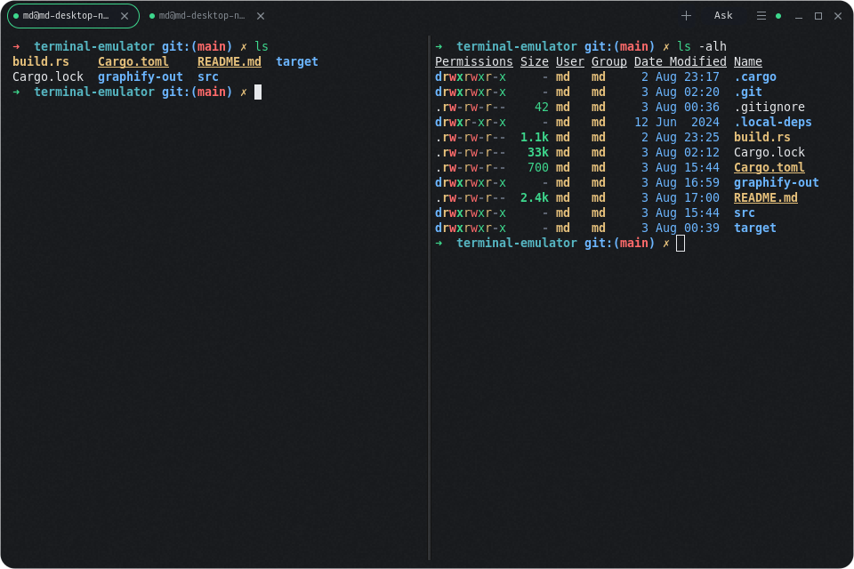
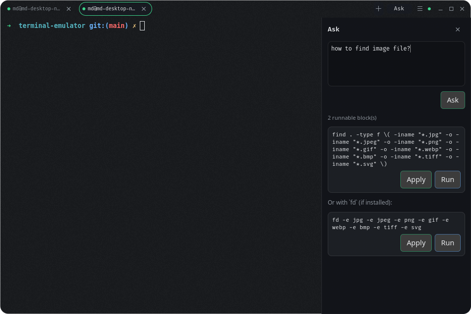
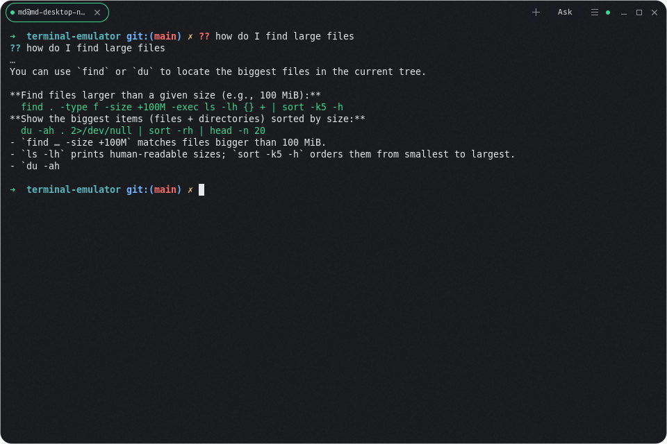

# El-Terminal

Lightweight borderless terminal emulator for Linux (GTK4 + VTE), with optional OpenAI-compatible Ask AI.

## Features

**Window & chrome**
- Undecorated window with rounded translucent chrome (no OS titlebar)
- Compositor backdrop blur when available (`ext-background-effect-v1`, or KWin blur)
- Drag the window by grabbing empty space on the top bar
- Pill-shaped tabs with accent status dots

**Terminal**
- Multi-tab sessions (each pane has its own PTY / `$SHELL`)
- Split panes within a tab (resizable; nestable)
- Right-click context menu: Copy, Paste, Select All, New Tab, Close Tab, Split Right/Down, Close Pane
- Ctrl+scroll to zoom font size (persisted)

**Settings** (`Ctrl+Shift+,` or menu → Settings…)
- Theme presets: Glass Dark, Nord, Solarized Dark, Light
- Font family and size
- OpenAI-compatible LLM: endpoint, API key, model
- In-shell Ask prefix (default `??`)
- Stored at `~/.config/el-terminal/settings.json`

**Ask AI**
- Side panel (toolbar **Ask** or `Ctrl+Shift+/`): prompt → reply; **Apply** / **Run** only on shell code blocks
- In-shell: type `?? your question` (or your configured prefix) and press Enter — the answer prints in the terminal below the command (panel stays closed)
- Environment pre-prompt from the active pane (shell, cwd, title, recent output; detects psql/mysql/python/etc. when possible, otherwise a generic terminal context)
- Streaming and non-streaming OpenAI-compatible `/chat/completions` responses



## Shortcuts

| Shortcut | Action |
|----------|--------|
| `Ctrl+Shift+C` / `V` | Copy / Paste |
| `Ctrl+Shift+A` | Select all |
| `Ctrl+Shift+T` | New tab |
| `Ctrl+Shift+W` | Close pane (or tab if last pane) |
| `Ctrl+Shift+R` / `D` | Split right / down |
| `Ctrl+Shift+,` | Settings |
| `Ctrl+Shift+/` | Toggle Ask panel |
| `Ctrl+Shift+Q` | Quit |
| `Ctrl+scroll` | Font size zoom |
| `?? …` + Enter | In-shell Ask (prefix configurable) |



## Dependencies

```bash
sudo apt install build-essential pkg-config libgtk-4-dev libvte-2.91-gtk4-dev
```

Rust toolchain: https://rustup.rs (`cargo` + `rustc`).

If `libvte-2.91-gtk4-dev` is not installed system-wide, this repo can use a local copy under `.local-deps/` (picked up automatically by `build.rs` when present).

## Build & run

```bash
cargo run --release
```

If VTE was linked from `.local-deps/`:

```bash
export LD_LIBRARY_PATH="$PWD/.local-deps/usr/lib/x86_64-linux-gnu${LD_LIBRARY_PATH:+:$LD_LIBRARY_PATH}"
cargo run --release
```

## Ask AI setup

1. Open **Settings** and set:
   - **Endpoint** — API base URL (e.g. `https://api.openai.com/v1` or `http://localhost:11434/v1` for Ollama)
   - **API key** — bearer token (use any non-empty value if your local server ignores auth)
   - **Model** — e.g. `gpt-4o-mini` or an Ollama model name
2. Ask from the side panel, or in the shell:

```text
?? how do I find large files under the current directory
```

## Layout

```
src/
  main.rs          # app entry + CSS
  app.rs           # window, tabs, drag, shortcuts, settings / Ask wiring
  ask.rs           # Ask side panel + in-shell Ask
  env_context.rs   # terminal / shell / DB environment for Ask pre-prompt
  llm.rs           # OpenAI-compatible chat client (stream + non-stream)
  settings.rs      # persisted settings model
  settings_ui.rs   # Settings dialog
  blur.rs          # Wayland compositor backdrop blur
  tab_bar.rs       # pill tabs / chrome widgets
  terminal_tab.rs  # VTE session + palette + font
  context_menu.rs  # right-click menu + actions
  chrome.rs        # rounded frosted fill + grain
  theme.css        # colors and chrome
```
